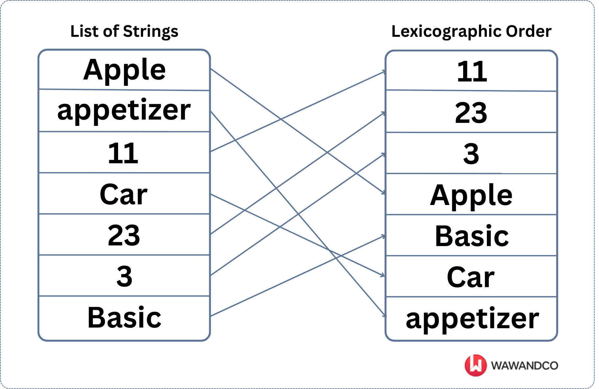

# Atividade Unidade 1 - Ordenando protocolos

## Objetivo: 
* Reforçar a importância do estudo da análise de sua complexidade na avaliação de algoritmos;
* Analisar os requisitos de um problema real, propondo uma solução computacional;
* Construir um protótipo de teste baseado na solução proposta;
* Entender os processos de manipulação de arquivos em *Python*.

## Motivação:

Uma *startup* especializada em análise de dados foi contratada por uma grande operadora de telefonia móvel para avaliar os processos de atendimento ao consumidor relacionados a reclamações. Cada atendimento recebe um número de protocolo semelhante ao mostrado na Figura 1. 

*Figura 1 - Exemplo de protocolo de atendimento.*

No caso específico dessa operadora o protocolo é composto de três campos, 2 números inteiros e um alfabético, separados por traços. O primeiro campo tem 10 dígitos e representa o número do atendimento, o segundo campo é alfabético e representa o tipo de atendimento, e por fim o último campo possui 4 dígitos e representa o ano em que o pedido foi protocolado.   

O primeiro passo na análise será organizar os protocolos de forma a obter além de uma sequência cronológica e por tipo de atendimento. Para isso um algoritmo de ordenação deve ser aplicado. Porém, por se tratar de um código que envolve letras e dígitos, uma ***ordenação lexicográfica*** (ver Figura 2) dos números de protocolos deve ser feita. 

*Figura 2 - Exemplo de ordenação lexicográfica de uma sequencia de cadeias de caracteres.*

A análise a ser feita deve abarcar todos os registros de reclamações de 2001 até 2024. A quantidade de registros é muito grande, portanto, **algoritmos de ordenação com complexidade `O(n²)` estão descartados**. Algoritmos `O(n.log(n))` seriam a escolha mais óbvia, mas dado que sabemos que os números de protocolos têm tamanho fixo, é possível utilizar algoritmos mais eficientes por conta dessa característica [1] [2]. 

Outro ponto importante é que, na implementação final, a *startup* pretende fazer uso de servidores com processamento paralelo, para reduzir o tempo de processamento. Portanto, o algoritmo a ser escolhido deve ter uma versão paralela [3].

Os diretores dessa *startup*, sabendo que você está cursando a disciplina de Estrutura de Dados na UFBA, resolveram contratá-lo para apresentar uma proposta de qual algoritmo de ordenação é a melhor solução para o problema de ordenação das bases de dados de protocolos.  

## Produtos Esperados:

Voce deverá apresentar aos diretores da *startup* dois produtos: 

1. Um pequeno relatório técnico[^1] onde voce demonstra sua capacidade de comunicação, deixando claros os critérios de escolha do algoritmo de ordenação, o quanto ele é aderente aos requisitos do problema e indicando a sua complexidade teórica [^2];
2. Uma aplicação protótipo, codificada em *Python*, que permita comprovar a eficiência do algoritmo de ordenação escolhido. 

Para a construção do protótipo voce deve seguir os seguintes critérios:

1. O protótipo deve ser codificado em *Python*, sem dependências externas [^3] e sem o uso de estruturas de dados prontas da linguagem [^4].
2. Como entrada o seu protótipo deve ler um arquivo texto (ASCII) com uma base de dados de numeros de protocolos não ordenados;
3. Como saída, seu protótipo produzirá um novo arquivo texto (ASCII) com a base de dados ordenada lexicograficamente;
4. O código do seu protótipo deve utilizar os conceitos de **Tipo Abstrato de Dados / Classes** e **Modularização**;
5. A clareza do seu código será avaliada, considerando as boas práticas de programação e documentação [6];  
6. O código deve ser disponibilizado no repositório indicado no *github Classroom*. 
7. A atividade deve ser entregue até o dia 20/10. Entregas fora do prazo sofrerão penalidade de 1,0 ponto a cada dia de atraso. 

Como etapa final do processo de avaliação, você será entrevistado para dar mais detalhes sobre a solução apresentada e elucidar qualquer dúvida sobre o seu desenvolvimento. 

Para facilitar o processo de testes, alguns arquivos contendo conjuntos de protocolos são disponibilizados nesse repositório, com volumes de dados diferentes. 

## A Avaliação:

Seu protótipo será avaliado pelos seguintes critérios:

| Critério | Pontuação |
| :--- | :---: |
| 1. Documentação em Markdown (README) | 1,0 |
| 2. Modularização do código | 1,0 | 
| 3. Uso de TAD | 1,0 |
| 4. Leitura e gravação dos arquivos | 1,0  |
| 5. Escolha/justificativa/analise da complexidade do algoritmo | 1,0 |
| 6. Implementação do algoritmo de ordenação | 5,0 |

A pontuação de cada item pode ser alterada em função das respostas na etapa de entrevista. 

## Observações Gerais:

> Plágio não é uma prática aceitável nem na academia nem no mercado de trabalho. Uma vez detectada, **TODOS** os envolvidos serão penalizados. 

> Não presuma nada! Pergunte ao professor ou ao monitor. 

> **Não compartilhe seu código nos canais do *Discord***
> Discussões conceituais podem ser feitas por lá, mas dúvidas específicas relacionadas a sua solução ou ao seu código devem ser encaminhadas de forma privada no *Discord* ou como *issues* no *github Classroom*.

# Referências Bibliográficas:

[1]     Cormen,T.H., Leiserson,C.E., Rivest,R.L., Stein,C. **Algoritmos – Teoria e Prática**. Editora Campus. 3a Edição, 2012..

[2]     Canning, J., Broder, A., Lafore, R. **Data Structures & Algorithms in Python**. Addison-Wesley. 2022.

[3]     N. Satish, M. Harris, and M. Garland. **Designing efficient sorting algorithms for manycore GPUs**. NVIDIA Technical Report NVR-2008-001, September 2008. Disponível em: https://mgarland.org/files/papers/nvr-2008-001.pdf

[4]     Erica Vartanian, **"6 coding best practices for beginner programmers"**. Disponível em:  https://www.educative.io/blog/coding-best-practices

[5]     Matt Cone, **Markdown Cheat Sheet - A quick reference to the Markdown syntax**. Disponível em: https://www.markdownguide.org/cheat-sheet/

[^1]: Renomeio o README original do seu repositório, e crie um novo arquivo README com o seu relatório em *Markdown* [5] 
[^2]: Não há necessidade de provas formais, mas você deve indicar referências bibliográficas consultadas que validem seus argumentos.
[^3]: Considere dependências externas de pacotes que precisariam ser instalados no ambiente *Python*, via *pip*, por exemplo. 
[^4]: Você deve criar seu TAD, definindo atributos e construindo os métodos necessários à sua manipulação, tal como no exemplo do vetor analisado durante as aulas.  
